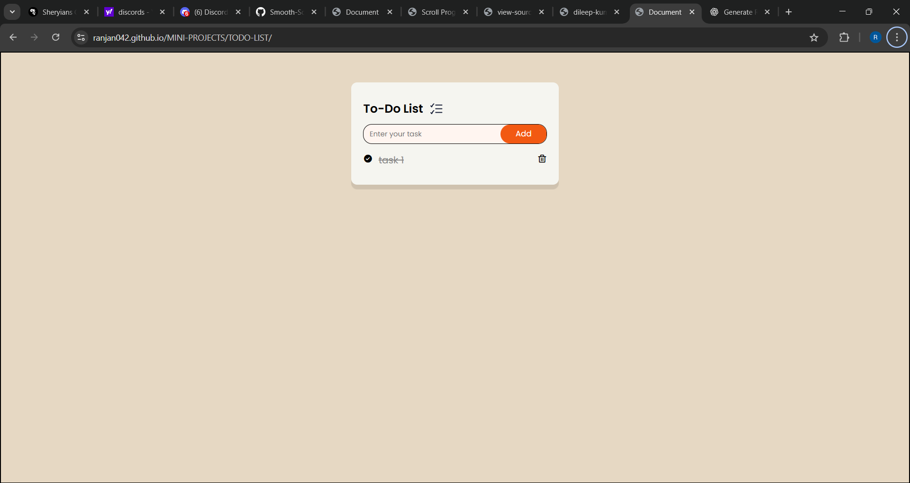

# 📝 To-Do List App  
A clean, minimal and interactive **To-Do List Web App** built using **HTML, CSS, and JavaScript**.  
Perfect beginner project for practicing **DOM Manipulation, Events, UI Design and Basic JS Logic**.

---

## 🚀 Live Demo  
👉 **View Project:** https://ranjan042.github.io/MINI-PROJECTS/TODO-LIST/

---

## 📸 Screenshot  
 

---
## 🎥 Demo Video

> 🎬 **Watch Demo:** [Click here to watch](demo.mp4)

---
## ⭐ Features  

- ✅ Add new tasks  
- ✅ Delete tasks  
- ✅ Smooth and simple UI  
- ✅ Fully responsive  
- ✅ Lightweight — No frameworks  

---

## 🛠️ Tech Stack  

| Technology | Purpose |
|-----------|----------|
| **HTML5** | Structure |
| **CSS3** | Styling |
| **JavaScript** | App Logic |

---

## 📂 Project Structure  

```bash
TODO-LIST/   
├── index.html    
├── style.css   
└── script.js
```  

---

## 🧠 How It Works  

- User enters a task in the input field  
- Clicking **Add** inserts the task into the list  
- Each task includes a **Delete** button  
- JavaScript dynamically updates the DOM using:  
  - `createElement()`  
  - `appendChild()`  
  - `addEventListener()`  
  - `remove()`  

---

## 🧪 Run Locally  

```
git clone <your-repo-url>
cd TODO-LIST
open index.html
```
## 🔮 Future Enhancements

- 🌙 Dark/Light Theme
- 📝 Edit existing tasks
- 🎨 Add animations
- 🔍 Filter: All / Completed / Pending
- 📅 Add deadlines & priority

---

## 🤝 Contributing

1. Fork the repo
2. Create a new branch:
   ```
   git checkout -b feature/your-feature        
    ```
3. Commit your changes
4. Push the branch
5. Open a pull request

## 📄 License

-   This project is MIT‑style / open‑source — free to use and modify.